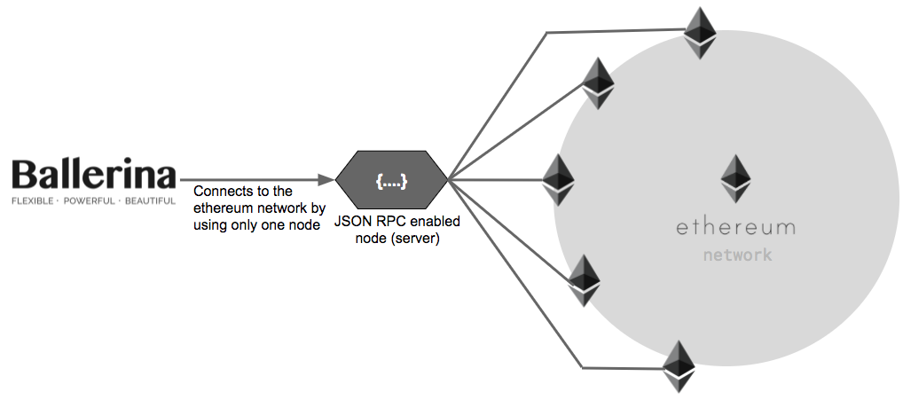

# Ballerina Ethereum Connector

*Ethereum is a decentralized platform for applications that run exactly as programmed without any chance of fraud, censorship or third-party interference* (https://www.ethereum.org/).

### Why do you need the JSON RPC API for Ethereum

JSON RPC is a remote procedure call protocol and the API is used to help integrate with Ethereum.

One advantage of using the JSON RPC API is the simplicity of storing the Ethereum blockchain ledger. The Ethereum blockchain ledger is more than 400GB in size. It is difficult to store the ledger in normal devices. Using the JSON RPC API, one device can store the whole ledger and others can use the stored blockchain ledger without keeping their own ledger.

After enabling JSON RPC, the node acts as a server. Because of that It's easy to spread decentralized apps among the people by hiding the complexity.

### Why would you use a Ballerina connector for Ethereum

Ballerina is a JSON friendly language. It is easy to write programs for the JSON RPC API if we have a connector for Ethereum. Ballerina is also an integration tool and can be used to easily integrate the Ethereum JSON RPC API with other endpoints.

The Ethereum connector allows you to access the Ethereum JSON RPC API through Ballerina. The Ethereum connector actions are invoked using a Ballerina main function. The following diagram illustrates how Ballerina connects to the JSON RPC-enabled server, which in turn integrates with the Ethereum network.



### Compatibility

|                                 |       Version                  |
|  :---------------------------:  |  :---------------------------: |
|  Ballerina Language             |   0.982.0                      |
|  JSON-RPC API Version           |   v2.0                        |

### Starting Geth Client

1. Download the Geth client from [https://geth.ethereum.org/downloads/](https://geth.ethereum.org/downloads/).

2. Install the Geth Client. [https://ethereum.github.io/go-ethereum/install/](https://ethereum.github.io/go-ethereum/install/).

3. Check whether the installation is complete or not from start the HTTP JSON-RPC by run the `geth` command in your command line .

### Enabling JSON RPC Server

1. Create a folder for chain data. Let's call that folder `<chaindata>`.

2. Let’s create a private network by running the following command. Here, change the `<chaindata>` value to your actual folder path.
    ````
    geth --identity "testServer" --rpc --rpcport "8080" --rpccorsdomain "*" --datadir "<chaindata>/TestChain" --port "30304" --nodiscover --rpcapi "db,eth,net,web3,admin,shh" --networkid 1999 console --shh`
    ````
3. To create the new account, use the following command in the Geth JavaScript console.
    ```
    personal.newAccount()
    ```

4. To start the mine, use the following command in the Geth JavaScript console.
    ```
    miner.start()
    ```
    
The following sections provide you with information on how to use the Ballerina Ethereum connector.

- [Contribute to the Code](#contribute-to-the-code)
- [Working with Ethereum Connector](#working-with-ethereum-connector)
- [Sample](#sample)

### Contribute to the Code

Clone the repository by running the following command. 

```shell
git clone https://github.com/wso2-ballerina/package-ethereum.git
```
   
### Working with Ethereum Connector 

First, import the `wso2/ethereum` package into the Ballerina project.

```ballerina
import wso2/ethereum;
```

To use the Ethereum Connector, first create an Ethereum Client endpoint.

```ballerina
endpoint ethereum:Client ethereumClient {
    jsonRpcVersion: " ",
    networkId: " ",
    jsonRpcEndpoint: ""
};
```

### Sample

```ballerina
import ballerina/config;
import ballerina/io;

public function main(string... args) {
    endpoint ethereum:Client ethereumClient {
        jsonRpcVersion: "",
        networkId: "",
        jsonRpcEndpoint: ""
    };

    var response = ethereumClient -> web3ClientVersion();
    match response {
        ethereum:Result result => {
            string value = result.result;
            io:println("The web3 client version: " + value);
        }
        ethereum:EthereumError e => io:println(e);
    }
}
```